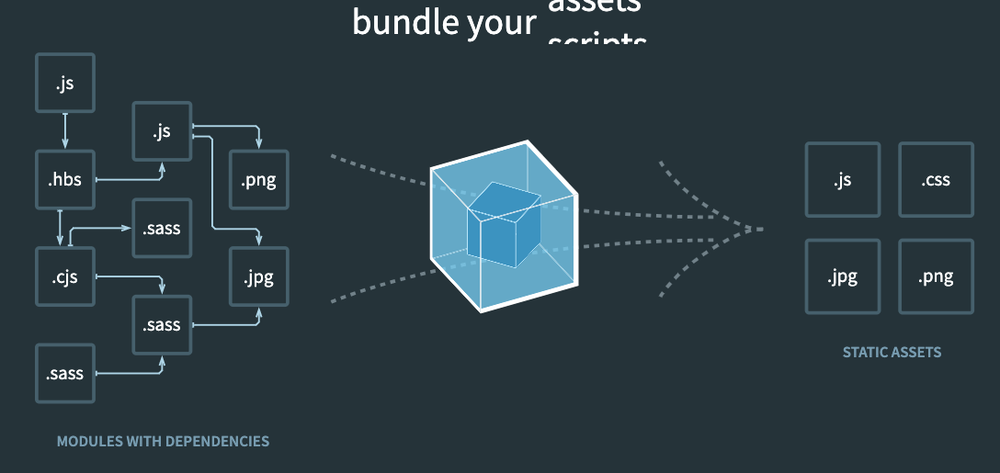
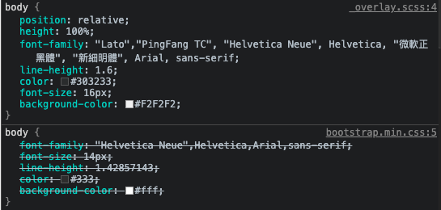
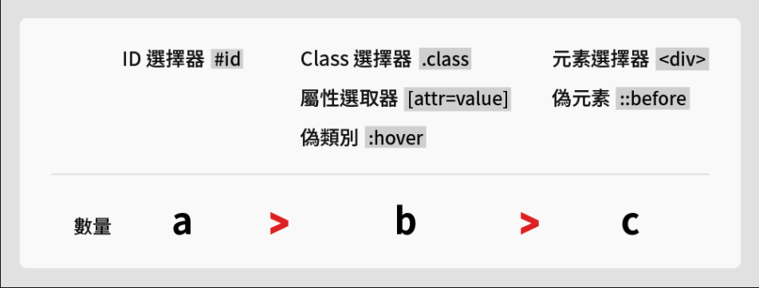

# Webpack 是做什麼用的？可以不用它嗎？

`[官方文件說](https://webpack.js.org/concepts/)：webpack is a static module bundler for modern JavaScript applications.`

直譯的話，就是說 `webpack 是一個現代 JS 應用的靜態模組包裝器`

### 所以要先理解的是，什麼是 `模組` ？

在軟體開發的領域中，有一句名言「不要重複造輪子」。如果別的開發者已經有寫好的功能，那我們直接拿來用就好，不用再自己開發一次。但開發者多半不會只開發功能，開發的目的是為了創造產品，功能只是產品的一部份。那我們要怎麼樣才能只拿到功能，而不是整體的產品呢？

看看你的手機，你有沒有摔壞過螢幕的經驗？明明螢幕壞了（如果沒有太嚴重），基本上通話、滑臉書、拍照這些功能都還是可以正常執行，仔細想想，如果螢幕壞了、或是相機壞了，整支手機就不能用，也太虧了。

將各個功能獨立出來，這件事就叫做 `模組化`。

在 `Node.js` 中，我們可以使用 `module.exports` 和 `require` 實現模組化。

假設我們有兩支檔案，一支是 `utils.js` 負責存放功能，然後使用 `module.exports` 將功能輸出

```jsx
// utils.js
function add(a, b) {
  return a + b  
}

module.exports = add // 把這個函式 export 出去
```

另一支檔案 `main.js` 則可以使用 `require` 將功能引入

```jsx
// main.js
var add = require('./utils') 
console.log(add(1, 2)) // 3
```

然而 `Node.js` 使用的 `module.exports` 和 `require` 卻不能在瀏覽器上運行。

### 再來我們要理解的是，什麼是 `打包` ？

前面說到，`Node.js` 使用 `module.exports` 和 `require` 來實現模組化，而這個做法是符合一個叫做 `commonJS` 的規範。而在 `ES6` 推出後，一個新的規範是使用 `import` 和 `export` 來實現模組化。

那我們之後可以統一使用 `import` 和 `export` 嗎？

首先在 `Node.js` 上無法執行，會出現 `SyntaxError: Unexpected identifier` 的錯誤，因為 `Node.js` 不認得。而在瀏覽器上使用，會出現 `Uncaught SyntaxError: Cannot use import statement outside a module` 的錯誤，要在引入時加上特別的 `type`，如：

```jsx
<script src="./main.js" type="module"></script>
```

就算解決上述的兩種錯誤，還會遇到其他麻煩的問題。比如說如果是使用 `ES6` 的 `import` 和 `export`，那在網頁開發上就沒辦法使用 `npm` 上其他人開發的套件，因為和使用 `Node.js` 不同，我們沒有 `node_modules` 這個資料夾去儲存套件。

> 「前端的世界很簡單，不支援或是支援度很差的東西，寫工具自己支援就好了」

為了解決標準不一、無法使用 `npm` 等問題，所以才需要 `webpack` 幫我們打包檔案。



`webpack` 在做的事，就是將彼此獨立的模組，打包成靜態資源。

所以簡單來說， `webpack` 到底是做什麼用的？它其實就是幫助我們把各個資源打包成一個檔案，來讓我們原本相互獨立的模組，功能還是可以照常運作。可以不用 `webpack` 嗎？可以，只是會變得很麻煩， `webpack` 只是一個幫助我們開發的工具，沒有做額外的事情。

# gulp 跟 webpack 有什麼不一樣？

先參照官網的解釋：`gulp is a toolkit to automate & enhance your workflow`，而 `webpack is a static module bundler for modern JavaScript applications`。
`gulp` 是 `task manager`，而 `webpack` 是 `bundler`。

在 `gulp` 中，我們主要是用來管理任務，比方說在程式上傳前，要先經過 `babel, sass, minify` 這些任務，而要經過哪些任務，這是我們要去定義的， `gulp` 只是幫助我們自動化的去執行這些事。有點像是小秘書的感覺，因為怕你忘記處理，又或是說每次上傳都要去自己處理這些事情很麻煩，所以他知道要幫我們做這些事。同樣的，因為任務是自己定義，所以也可以告訴 `gulp` 要處理一些比較特別的事情，比如說 `幫我校正一下時間、幫我清空一下桌面` 這些也都可以做到。

相較而言， `webpack` 在做的事情，只是幫我們把資源打包再一起，而這些資源可以是 `JS, CSS, image` 等等，只是它在將每個資源打包在一起的時候，可以經過 `loader` 再次加工。比方說要把 `JS` 打包時，可以經過 `babel-loader` 將語法轉換後，再打包起來。不過 `webpack` 雖然將模組的概念延伸很廣，但它還是做不到 `校正時間、清空桌面` 這類很特別的事情。

`gulp` 和 `webpack` 使用上會覺得很類似，一大原因是我們在使用 `gulp` 時都只有使用到 `資源轉換` 這件事情，而這剛好又是 `webpack` 的守備範圍。但就上限而言，其實 `gulp` 應該可以處理更多元的 `task` 而不單單只有資源的轉換。

# CSS Selector 權重的計算方式為何？

使用 `CSS Selector` 時，很常會有一個情況是，同一個元素卻被不同的 `CSS` 套用，這時候是怎麼決定哪一個 `CSS` 勝出的呢？



關鍵因素就是 `權重`。

權重指的是 `CSS` 的優先權：
1. 若相同權重，後寫的 `CSS` 可以覆蓋先寫的 `CSS`
2. 若相同元素卻套用不同的選擇器時，權重高的會覆蓋權重低的

在了解權重的計算方式前，我們可以先了解選擇器的優先權。

選擇器的優先權：

```
Animation（在動畫執行期間）>
!important > 
inline style > 
ID > 
Class/psuedo-class(偽類)/attribute（屬性選擇器） > 
Element/偽元素 >
* >
繼承的屬性
```

1. Animation（在動畫執行期間）： `關鍵影格（@keyframes）` 中的 `CSS` 在 `動畫執行期間` 具有絕對的優先權

2. !important: 撇除 Animation 不論， `!important` 是權重中的大魔王，可以無視其他的權重。所以沒事不要用，因為一旦用了 `!important` 在後續修改 `CSS` 中，若要改變原本的 `CSS` 又不影響之前的檔案，後續修改的 `CSS` 也必須都加上 `!important` 造成維護上的困難。

    ```html
    <p class="title">hi</p>
    ```
    ```css
    p{
      color: red !important;
      font-size: 20px;
    }
    .title{
      color: blue;
      font-size: 16px
    }
    ```

    原本 `.title(class)` 優先權應該大於 `<p>(element)`，但因為 `<p> color` 使用了 `!important` 所以覆蓋 `.title color`，結果變成這樣：

    ```css
    color: red !important; // !important 覆蓋上層元素的屬性
    font-size: 16px; // 繼承上層 .title 的屬性
    ```
3. inline style 行內樣式: 寫在 `HTML` 行內的 `style`

    ```html
    <p style="color: red;">Hello</p>
    ```

4. id 選擇器: `HTML` 中的 `id="footer`, `CSS` 中的 `#footer`

5. class 類別選擇器，[attr=value] 屬性選擇器，`:` 偽類 : 

    class 類別選擇器：`HTML` 中的 `class="profile`, `CSS` 中的 `.profile`

    [attr=value] 屬性選擇器：如 `[type=checkbox]`

    `:` 偽類：如 `:link, :hover, :focus, :nth-child()` 等等

6. element 元素， `::` 偽元素：

    element 元素：如 `div, p, ul, ol, li, em, header, footer, article....`

    `::` 偽元素：如 `::before, ::after`


7. `*`：基本上可以看作預設值，權重最低，只要有寫 `CSS` 都能覆蓋。

8. 繼承的屬性：

    ```html
    <div>
      <p>內文</p>
    </div>
    ```
    ```css
    div {
      color: red;
    }
    ```

    儘管 `<p>` 沒有撰寫 `CSS` ，但 `<p>` 會繼承父層 `<div>` 的屬性，所以 `內文` 會顯示 `color: red`

知道了優先權後，那該怎麼具體計算權重呢？



舉例來說：

|選擇器 |權重 |順位 |
|------|----|----|
|#nav > li.active::before|1, 1, 2|1|
|#nav li.active|1, 1, 1|2|
|div .card.active:hover::before|0, 3, 2|3|
|ul > li:hover|0, 1, 2|4|

參考資料：
- [Day20：小事之 CSS 權重 (css specificity)
](https://ithelp.ithome.com.tw/articles/10196454)
- [Mily 同學的作業](https://github.com/Lidemy/mentor-program-4th-milyzoo/pull/16/files?short_path=b142aa1#diff-b142aa11160237a68ddba70c899573ee5f4b6d2ccf430e462e66a972a207d24f)