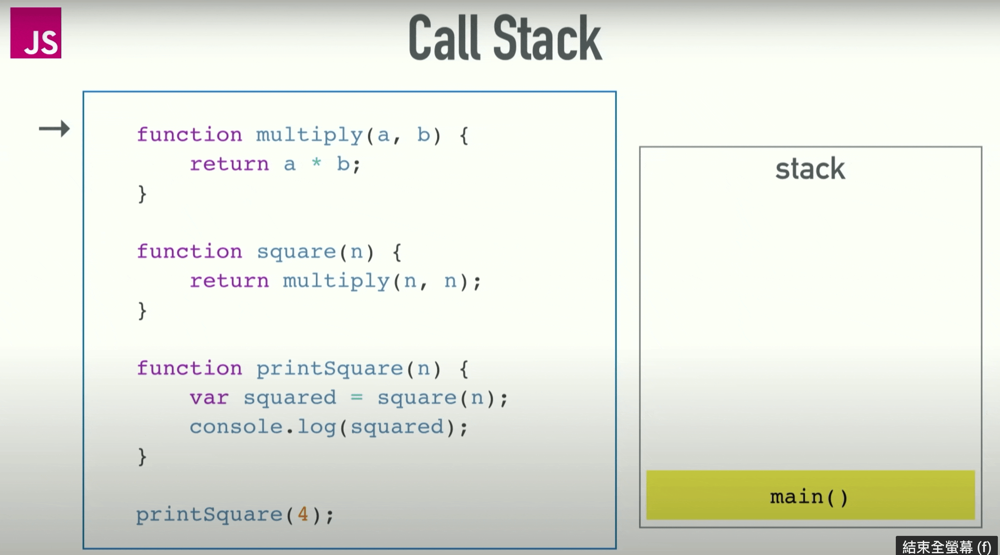

## hw1：Event Loop

在 JavaScript 裡面，一個很重要的概念就是 Event Loop，是 JavaScript 底層在執行程式碼時的運作方式。請你說明以下程式碼會輸出什麼，以及盡可能詳細地解釋原因。

``` js
console.log(1)
setTimeout(() => {
  console.log(2)
}, 0)
console.log(3)
setTimeout(() => {
  console.log(4)
}, 0)
console.log(5)
```

Ans:
```
1
3
5
2
4
```

### 題目解析

1. 讀取檔案時產生主函式 `main` 放入 stack 中。
2. `console.log(1)` 放入 stack 並執行，印出 1，`console.log(1)` pop。
3. 執行第一個 `setTimeout`，由於 `setTimeout` 屬於非同步的 WEB API，因此將其中的 callback function `() => {
  console.log(2) }` 交由 WEB API 管理，並開始計時。
4. 因計時設置 0 毫秒，`() => {
  console.log(2) }` 放入 callback queue 等待。
5. `console.log(3)` 放入 stack 並執行，印出 3，`console.log(3)` pop。
6. 執行第二個 `setTimeout`，由於 `setTimeout` 屬於非同步的 WEB API，因此將其中的 callback function `() => {
  console.log(4) }` 交由 WEB API 管理，並開始計時。
7. 因計時設置 0 毫秒，`() => {
  console.log(4) }` 放入 callback queue 等待。
8. `console.log(5)` 放入 stack 並執行，印出 5，`console.log(5)` pop。
9. 因 call stack 已經清空，event loop 偵測 queue 有無待執行的程式，有，因此 `() => {
  console.log(2) }` 被移入 stack 中執行，印出 2。
10. 因 call stack 已經清空，event loop 偵測 queue 有無待執行的程式，有，因此 `() => {
  console.log(4) }` 被移入 stack 中執行，印出 4。

### 簡述 Event Loop

JS 屬於 single-threaded, non-blocking, asynchronous concurrent 的語言。

-  single-threaded 單執行緒：

    意指 JS 一次只能做一件事。實際運作代表 JS 只有一個 call stack。

    

    stack 屬於資料結構中的一種，特性為後進先出。

    以圖為例，在執行檔案時會先產生主函式 `main`
    
    然後依序把 function call 放入 stack： 
    
    `printSquare(4) → square( ) → multiply( )`

    最後再依序 pop 出： 
    
    `multiply( ) → square( ) → console.log( squared ) → printSquare( ) → main ( )` → 執行完畢

- non-blocking：

    blocking 阻塞，在這邊的定義是，「一段執行很慢的程式，卻又放在 stack 上」的狀態。

    由於我們在瀏覽器上執行 JS，若產生阻塞，瀏覽器會停止渲染、靜止不動，造成使用者體驗上的不便。

- asynchronous:

    為了避免阻塞的發生，所以瀏覽器與 Node.js 基本上都是「非同步」的執行程式。

    比方說常見的 `setTimeout()`：

    ```
    console.log('hi')

    setTimeOut(function(){
      console.log('there')
    }, 5000)

    console.log('end')

    /*
    hi
    end
    there
    */
    ```

- Concurrency and Event Loop

  JS 是單執行緒的語言（也就是一次只能做一件事），但又從 `setTimeOut()` 證明可以執行非同步的程式，怎麼做到的？

  **透過 Event Loop 這個機制**

  Event Loop 執行的前提是因為我們在「瀏覽器」上執行程式，而瀏覽器上不只有 JS runtime。

  

  圖中當我們執行 `respond()`，會返回一個 `setTimeOut` 的呼叫，由於 `setTimeOut` 是瀏覽器 WebAPI 提供的功能，因此 `setTimeOut` 執行的 callback: `() ⇒ { return 'hey' }` 會傳遞給 WebAPI 處理。
  接著 `setTimeOut()`, `respond()` 依序執行完畢 pop

  

  

  在 WebAPI 中會執行定時器，計時結束後 callback function 不會立刻丟回去 `call stack` 執行，而是會放入 `callback queue`。

  

  `event loop` 的工作就是連結起 `call stack` 與 `queue`

  它會不斷監測，如果 `call stack` 裡的函式都執行完畢，就會去看 `queue` 有沒有等待執行的函式，如果有就放入 `call stack` 

  

  經由 `event loop` 從 `queue` 丟回來的函式，在 `call stack` 中執行，如果執行完畢得到返回值，就 pop
  
### 參考資料：
1. [what the heck is the event loop anyway?](https://www.youtube.com/watch?v=8aGhZQkoFbQ)
2. [JavaScript Visualized: Event Loop](https://dev.to/lydiahallie/javascript-visualized-event-loop-3dif)